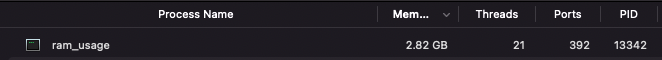
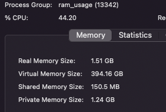
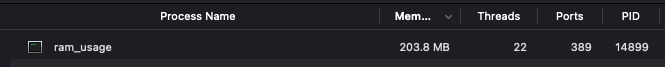

# bevy ram usage issue

Minimum reproduction of high RAM usage on a Macbook Pro with M1 Max.

The project simply loads ~20MB of PNG assets and two fonts from the `assets` folder,
then displays some text in one of the fonts against a plain background.

With `cargo run --release --features all_assets`  this uses ~2.8GB of RAM as reported by Activity Monitor:

With `cargo run --release --features only_font` (which only loads the font used to display text) it uses ~200MB:

